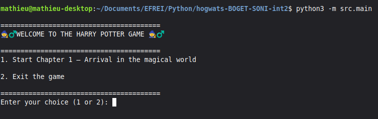

# 🪄 Hogwarts Game

🎮 **Hogwarts Game** is a narrative game inspired by **the first part of the first book of _Harry Potter_: _Harry Potter and the Philosopher’s Stone_**.  
Dive into the magical world of Hogwarts through an **interactive**, **choice-based**, and **text-driven** adventure, playable directly in the terminal.

---

## 📖 Project Description

This project consists of creating a **branching narrative game** set in the **Harry Potter universe**.  
The player takes on the role of a young wizard and progresses through multiple chapters, where each choice influences the story.

🧙‍♀️ The game is **entirely terminal-based** and focuses on:
- narrative immersion,
- character customization,
- story progression through player decisions.

---

## 🚀 Main Features

- 🧙‍♂️ **Choice-based gameplay**
- 📚 **Multi-chapter storyline**
- 🧾 **Character creation and progression**
- 💾 **Save and load system**
- 🏰 **Hogwarts universe integration**
- 💻 **100% terminal-based interface**

---

## 🛠️ Technologies Used

- 🐍 **Python**


--- 

## 📂 Project Structure

```
📁 projet
 ├── 📁 src
 |    ├── 📁 chapters
 |    |    ├── 📁 test_chapitre
 |    |    |    ├── test_all_chapters.py
 |    |    ├── 📁 sauvegardes
 |    |    |    ├── sauvegarde_donnees_personnage.json
 |    |    |    ├── sauvegarde_chapter_1.json
 |    |    |    ├── sauvegarde_chapter_2.json
 |    |    |    ├── sauvegarde_chapter_3.json
 |    |    |    ├── sauvegarde_chapter_4.json
 |    |    |    ├── sauvegarde_chapter_5.json
 |    |    ├── chapter_1.py
 |    |    ├── chapter_2.py
 |    |    ├── chapter_3.py
 |    |    ├── chapter_4.py
 |    |    ├── chapter_5_extension.py
 |    ├── 📁 data 
 |    |    ├── equipes_quidditch.json
 |    |    ├── houses.json
 |    |    ├── inventory.json
 |    |    ├── pets.json
 |    |    ├── quiz_magie.json
 |    |    ├── spells.json
 |    ├── 📁 universe 
 |    |    ├── character.py
 |    |    ├── house.py
 |    ├── 📁 utils
 |    |    ├── input_utils.py
 │    ├── main.py
 │    ├── menu.py
 ├── 📁 assets
 │    ├── images/
 │    ├── sons/
 ├── requirements.txt
 ├── README.md
 ├── TODO.md
 ├── faire_un_exe_propre.md
 ├── .gitignore
```

---

## ▶️ Installation & Execution

### **1️⃣ Clone the project**

```bash
git clone https://github.com/Mboget/hogwats-BOGET-SONI-int2.git
cd hogwats-BOGET-SONI-int2
```

### **2️⃣ Create a virtual environment (optional but strongly recommended)**

```bash
python -m venv venv
source venv/bin/activate   # Linux / Mac
venv\Scripts\activate      # Windows
```

### **3️⃣ Install dependencies**

```bash
pip install -r requirements.txt
```

### **4️⃣ Run the game**

- 🐧 On linux : 
```bash
python3 -m src/main
```

- On Windows : 
```bash
python -m src/main
```

---

## 🎨 Screenshots

Some extracts from the game running in the terminal:


---

## Development Organization

### 🔧 Methodology

The project was developed using Git for version control and collaboration.
It is organized into several branches:

 - main branch: stable and functional version,

 - backup branch: created after an incident on the main branch,

 - development branch: used to store experimental code and potential features (such as a graphical interface).

### 🔁 Architecture Overview

 - The project has a single entry point: main.py

 - main.py redirects to menu.py, where the player chooses whether to start the game

 - The game then runs through the chapters in order (1 to 4)

 - The input_utils.py file centralizes utility functions:

    - letter-by-letter text display,

    - user choice handling,

    - number input,

    - save loading

 - Two main classes define the game universe:

    - Character

    - House

---

## 📌 À propos

 - **👨‍💻 Authors:** Mathieu BOGET & Kavani SONI

 - **👨‍🏫 Supervisor:** Gwalid

 - **🎓 Academic Year:** P1-INT – EFREI, Grande École du Numérique 

---
